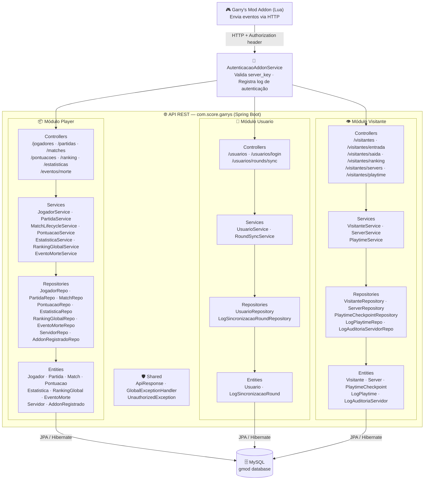
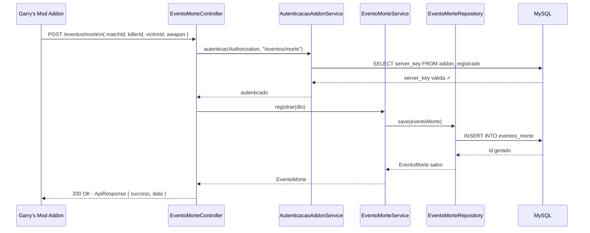
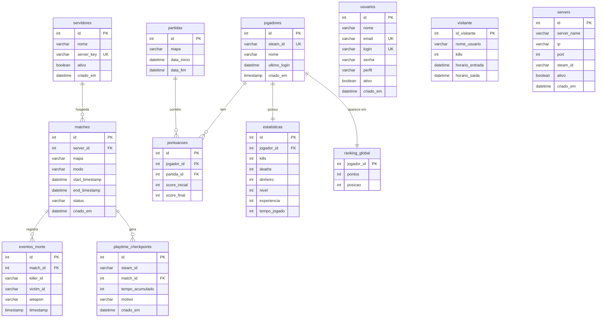

# 🎮 Garrys Mod — Score API

> Back-end REST desenvolvido em **Spring Boot** para integração com servidores de **Garry's Mod**.  
> Registra jogadores, partidas, pontuações, estatísticas, eventos de morte, ranking global e tempo de jogo em tempo real via addon Lua.

---

## 📋 Sumário

- [Visão Geral](#visão-geral)
- [Diagrama de Arquitetura](#diagrama-de-arquitetura)
- [Diagrama de Fluxo de uma Requisição](#diagrama-de-fluxo-de-uma-requisição)
- [Diagrama do Banco de Dados](#diagrama-do-banco-de-dados)
- [Módulos do Sistema](#módulos-do-sistema)
- [Endpoints da API](#endpoints-da-api)
- [Tecnologias Utilizadas](#tecnologias-utilizadas)

---

## Visão Geral

O sistema funciona como uma ponte entre o servidor de jogo (Garry's Mod) e um banco de dados MySQL.  
Um **addon escrito em Lua** rodando dentro do servidor de jogo envia requisições HTTP para esta API sempre que eventos importantes acontecem — entrada de jogador, morte, fim de partida, pontuação, etc.

A API está dividida em **três módulos principais**, cada um responsável por um tipo de usuário do sistema:

| Módulo | Responsabilidade |
|---|---|
| **Player** | Jogadores registrados com Steam ID, partidas, pontuações, estatísticas e ranking |
| **Usuario** | Administradores e operadores do sistema com login/senha |
| **Visitante** | Jogadores anônimos sem cadastro, rastreados por sessão |

---

## Diagrama de Arquitetura

O diagrama abaixo mostra a estrutura completa do sistema, desde o cliente até o banco de dados.

---

## Diagrama de Fluxo de uma Requisição

O fluxo abaixo mostra o que acontece quando o addon registra um **evento de morte** no servidor.

---

## Diagrama do Banco de Dados

Tabelas principais e seus relacionamentos.

---

## Módulos do Sistema

### 📦 Módulo Player

Responsável pelos jogadores **registrados** que possuem Steam ID.

| Classe | Responsabilidade |
|---|---|
| `JogadorService` | Cadastra jogador por Steam ID. Ao criar, inicializa automaticamente `Estatistica` e `RankingGlobal` zerados |
| `MatchLifecycleService` | Valida se o servidor está ativo e cria uma `Match` com status `in_progress`. Registra `LogMatch` |
| `PontuacaoService` | Cria pontuação por partida e finaliza atualizando kills/deaths/score na `Estatistica` |
| `EstatisticaService` | Lê e atualiza kills, deaths, dinheiro, nível e experiência de cada jogador |
| `EventoMorteService` | Registra cada morte com killer, vítima e arma usada. Protegido por autenticação de addon |
| `RankingGlobalService` | Expõe o ranking ordenado por pontos |

### 👤 Módulo Usuario

Responsável pelos **administradores** da plataforma.

| Classe | Responsabilidade |
|---|---|
| `UsuarioService` | CRUD completo com validação de login e e-mail únicos. Autenticação simples por login/senha |
| `RoundSyncService` | Sincroniza dados de rounds vindos do addon. Autenticado via `Authorization` header |

### 👁️ Módulo Visitante

Responsável pelos jogadores **anônimos** (sem cadastro).

| Classe | Responsabilidade |
|---|---|
| `VisitanteService` | Registra entrada/saída com hora e kills via stored procedures do MySQL |
| `ServerService` | Cadastra servidores de jogo com validação de admin via header `X-Admin-User` |
| `PlaytimeService` | Registra checkpoints de tempo de jogo por Steam ID |

---

## Endpoints da API

### Player

| Método | Rota | Descrição |
|---|---|---|
| `POST` | `/jogadores` | Cadastra jogador e inicializa estatísticas |
| `GET` | `/jogadores` | Lista todos os jogadores |
| `GET` | `/jogadores/{id}` | Busca jogador por ID |
| `POST` | `/matches` | Cria uma nova partida (match) |
| `POST` | `/partidas` | Cria partida simplificada |
| `GET` | `/partidas` | Lista partidas |
| `PUT` | `/partidas/{id}/finalizar` | Finaliza partida |
| `POST` | `/pontuacoes` | Cria pontuação |
| `GET` | `/pontuacoes/partida/{id}` | Lista pontuações de uma partida |
| `PUT` | `/pontuacoes/finalizar` | Finaliza pontuação com kills/deaths |
| `GET` | `/estatisticas/jogador/{id}` | Busca estatísticas de um jogador |
| `PUT` | `/estatisticas/jogador/{id}` | Atualiza estatísticas |
| `GET` | `/ranking` | Ranking global de pontos |
| `POST` | `/eventos/morte` 🔐 | Registra evento de morte em partida |

### Usuario

| Método | Rota | Descrição |
|---|---|---|
| `POST` | `/usuarios` | Cria novo usuário |
| `GET` | `/usuarios` | Lista usuários |
| `GET` | `/usuarios/{id}` | Busca por ID |
| `PUT` | `/usuarios/{id}` | Atualiza usuário |
| `DELETE` | `/usuarios/{id}` | Remove usuário |
| `POST` | `/usuarios/login` | Autenticação por login/senha |
| `POST` | `/usuarios/rounds/sync` 🔐 | Sincroniza dados de rounds |

### Visitante

| Método | Rota | Descrição |
|---|---|---|
| `GET` | `/visitantes` | Lista visitantes ativos |
| `GET` | `/visitantes/ranking` | Ranking de kills de visitantes |
| `POST` | `/visitantes/entrada` | Registra entrada no servidor |
| `PUT` | `/visitantes/saida/{id}` | Registra saída com kills |
| `DELETE` | `/visitantes/{id}` | Remove visitante |
| `POST` | `/visitantes/servers` 🔑 | Cadastra servidor (requer `X-Admin-User`) |
| `POST` | `/visitantes/playtime` 🔐 | Registra checkpoint de playtime |

> 🔐 Requer header `Authorization` com server_key válida  
> 🔑 Requer header `X-Admin-User`

---

## Tecnologias Utilizadas

| Tecnologia | Versão | Uso |
|---|---|---|
| Java | 17+ | Linguagem principal |
| Spring Boot | 3.x | Framework web |
| Spring Data JPA | 3.x | Persistência e repositórios |
| Hibernate | 6.x | ORM / mapeamento objeto-relacional |
| MySQL | 8.x | Banco de dados relacional |
| Lombok | latest | Redução de boilerplate |
| Bean Validation | 3.x | Validação de DTOs |
| Maven | 3.x | Gerenciamento de dependências |

---

## Banco de Dados

O banco `gmod` é criado em MySQL com:

- **Tabelas** mapeadas via JPA (`@Entity`)
- **Stored Procedures** para operações de Visitante (`registrar_entrada`, `registrar_saida`, `ranking_kills`)
- **Triggers** automáticos para log de ações em `jogadores` e `visitante`
- **Índices** para otimizar queries de ranking e busca por nome

---

