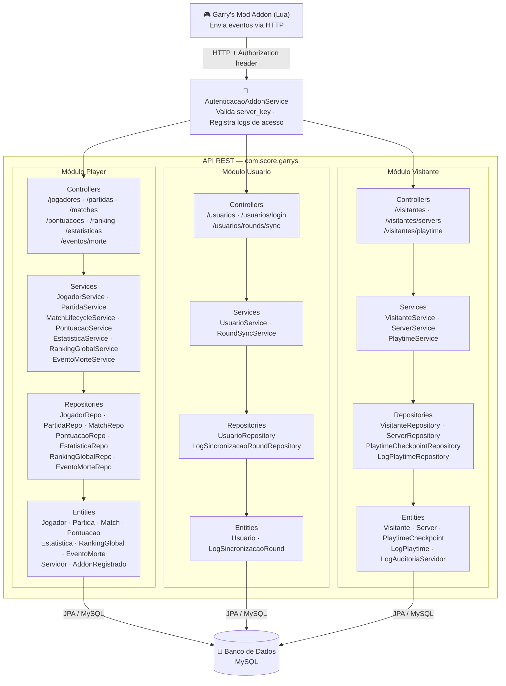
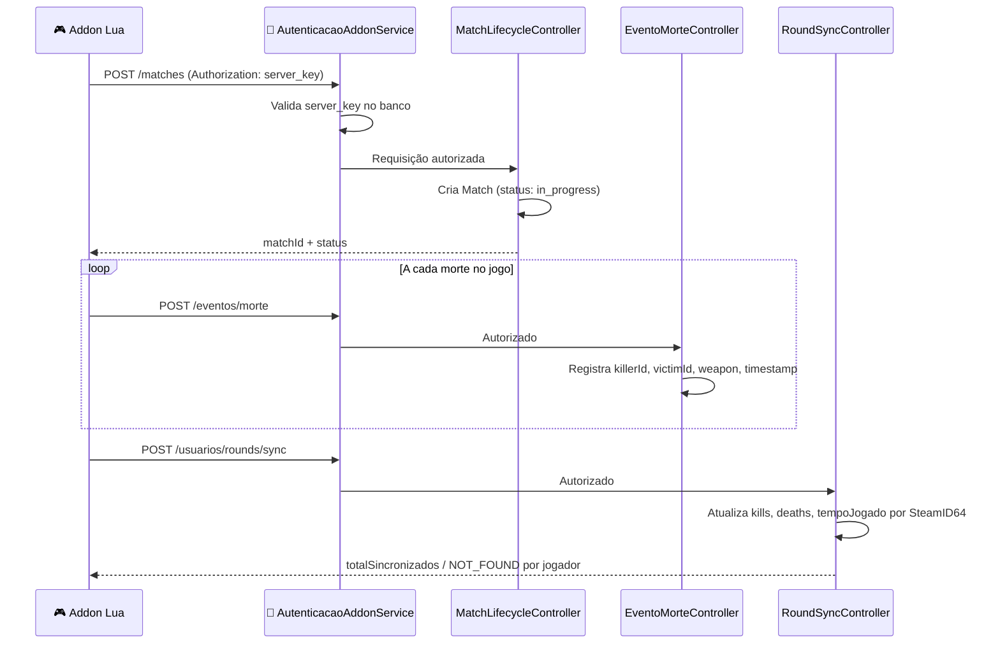

 🎮 Garrys Mod — Score API

API REST desenvolvida em **Java com Spring Boot** para gerenciar jogadores, partidas, pontuações e estatísticas de um servidor de **Garry's Mod**. O sistema recebe eventos em tempo real vindos de um addon Lua rodando no servidor do jogo.

---

## 🏗️ Arquitetura do Sistema

O projeto segue a arquitetura em camadas do Spring Boot, organizado em três módulos independentes: **Player**, **Usuario** e **Visitante**.



---

## 🔄 Fluxo Principal — Ciclo de uma Partida



---

## 📦 Estrutura de Pacotes

```
com.score.garrys
├── Player/
│   ├── controller/   ← Recebe requisições HTTP
│   ├── service/      ← Regras de negócio
│   ├── repository/   ← Acesso ao banco de dados
│   ├── model/        ← Entidades JPA (tabelas)
│   ├── dto/          ← Objetos de entrada e saída da API
│   ├── mapper/       ← Conversão Entity ↔ DTO
│   └── config/       ← GlobalExceptionHandler
├── Usuario/
│   ├── controller/
│   ├── service/
│   ├── repository/
│   ├── model/
│   ├── dto/
│   └── mapper/
└── Visitante/
    ├── controller/
    ├── service/
    ├── repository/
    ├── model/
    ├── dto/
    └── mapper/
```

---

## 🧩 Principais Entidades

| Entidade | Módulo | Descrição |
|---|---|---|
| `Jogador` | Player | Jogador registrado com SteamID. Ao criar, gera Estatistica e RankingGlobal automaticamente. |
| `Match` | Player | Partida vinculada a um Servidor. Possui status `in_progress` → finalizado. |
| `Pontuacao` | Player | Score inicial e final de um jogador em uma partida. |
| `Estatistica` | Player | Kills, deaths, dinheiro, nível, XP e tempo jogado acumulados do jogador. |
| `RankingGlobal` | Player | Pontuação e posição global do jogador. |
| `EventoMorte` | Player | Registro de cada morte: killer, victim, weapon e timestamp. |
| `Usuario` | Usuario | Conta de acesso ao painel administrativo (login/senha). |
| `LogSincronizacaoRound` | Usuario | Log de cada sincronização de round por SteamID64. |
| `Visitante` | Visitante | Jogador não registrado que entrou no servidor. |
| `Server` | Visitante | Servidor de jogo com IP, porta, rconKey e steamId. |
| `PlaytimeCheckpoint` | Visitante | Tempo acumulado de jogo por steam_id e match_id. |

---

## 🔐 Autenticação

Rotas sensíveis exigem o header `Authorization` com a `server_key` do servidor cadastrado. O `AutenticacaoAddonService` valida a chave e registra um `LogAutenticacaoAddon` a cada chamada.

Rotas protegidas:
- `POST /matches`
- `POST /eventos/morte`
- `POST /usuarios/rounds/sync`
- `POST /visitantes/playtime`

---

## ⚙️ Tecnologias

| Tecnologia | Uso |
|---|---|
| Java 17 | Linguagem principal |
| Spring Boot | Framework web e injeção de dependência |
| Spring Data JPA | Mapeamento objeto-relacional (ORM) |
| Hibernate | Implementação do JPA |
| MySQL | Banco de dados relacional |
| Lombok | Redução de boilerplate (@Builder, @Getter, etc.) |
| Bean Validation | Validação de DTOs com @Valid |

---

## 🚀 Como executar

```bash
# Clone o repositório
git clone https://github.com/Black-Mirrorlnj/Back-End.git

# Configure o banco de dados em application.properties
spring.datasource.url=jdbc:mysql://localhost:3306/garrys
spring.datasource.username=seu_usuario
spring.datasource.password=sua_senha

# Execute
./mvnw spring-boot:run
```
