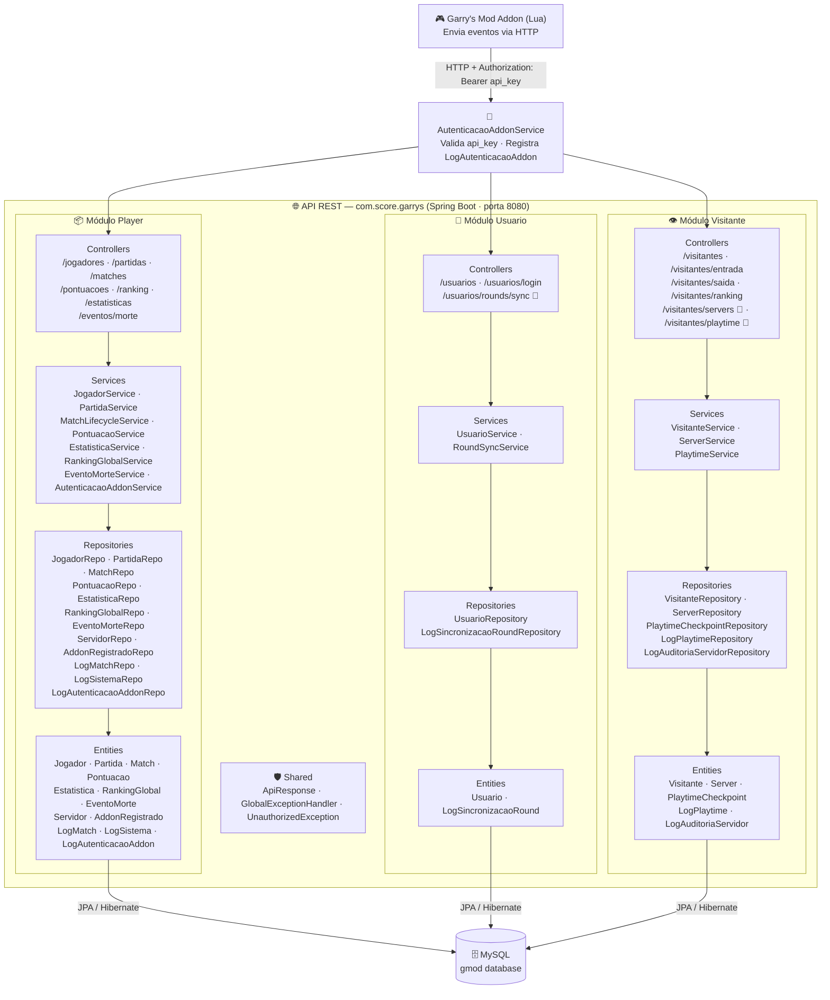
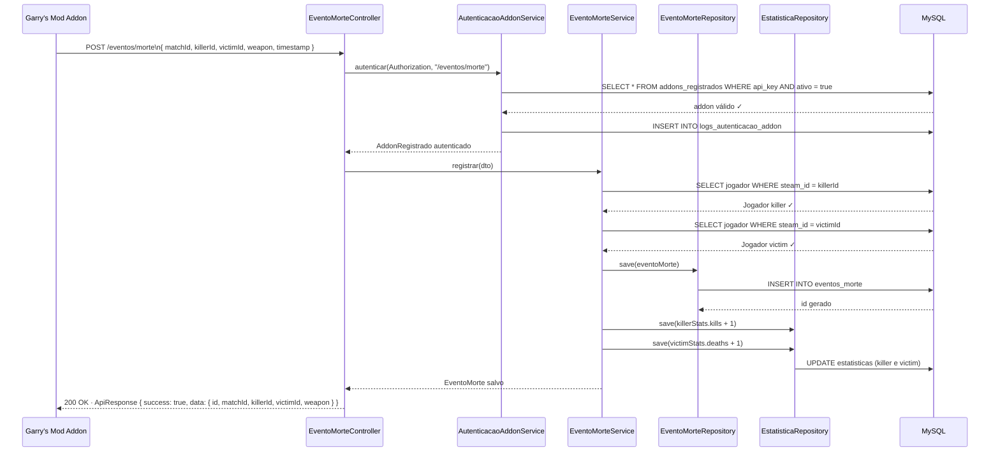

# 🎮 Garrys Mod — Score API

> Back-end REST desenvolvido em **Spring Boot** para integração com servidores de **Garry's Mod**.  
> Registra jogadores, partidas, pontuações, estatísticas, eventos de morte, ranking global e tempo de jogo em tempo real via addon Lua.

---

## 📋 Sumário

- [Visão Geral](#visão-geral)
- [Diagrama de Arquitetura](#diagrama-de-arquitetura)
- [Diagrama de Fluxo de uma Requisição](#diagrama-de-fluxo-de-uma-requisição)
- [Diagrama do Banco de Dados](#diagrama-do-banco-de-dados)
- [Módulos do Sistema](#módulos-do-sistema)
- [Endpoints da API](#endpoints-da-api)
- [Banco de Dados — Triggers e Procedures](#banco-de-dados--triggers-e-procedures)
- [Tecnologias Utilizadas](#tecnologias-utilizadas)

---

## Visão Geral

O sistema funciona como uma ponte entre o servidor de jogo (Garry's Mod) e um banco de dados MySQL.  
Um **addon escrito em Lua** rodando dentro do servidor de jogo envia requisições HTTP para esta API sempre que eventos importantes acontecem — entrada de jogador, morte, fim de partida, pontuação, playtime, etc.

A API está dividida em **três módulos principais**, cada um responsável por um tipo de usuário do sistema:

| Módulo | Responsabilidade |
|---|---|
| **Player** | Jogadores registrados com Steam ID, partidas, pontuações, estatísticas, eventos de morte e ranking |
| **Usuario** | Administradores e operadores do sistema com login/senha e sincronização de rounds |
| **Visitante** | Jogadores anônimos sem cadastro, rastreados por sessão com entrada/saída e playtime |

---

## Diagrama de Arquitetura



---

## Diagrama de Fluxo de uma Requisição

O fluxo abaixo mostra o que acontece quando o addon registra um **evento de morte** no servidor.



---

## Diagrama do Banco de Dados

Tabelas completas com todos os campos e relacionamentos.

```mermaid
erDiagram
    jogadores {
        int id PK
        varchar steam_id UK
        varchar nome
        datetime ultimo_login
        timestamp criado_em
    }

    partidas {
        int id PK
        varchar mapa
        datetime data_inicio
        datetime data_fim
    }

    matches {
        int id PK
        int server_id FK
        varchar mapa
        varchar modo
        datetime start_timestamp
        datetime end_timestamp
        varchar status
        datetime criado_em
    }

    pontuacoes {
        int id PK
        int jogador_id FK
        int partida_id FK
        int score_inicial
        int score_final
    }

    estatisticas {
        int id PK
        int jogador_id UK
        int kills
        int deaths
        int dinheiro
        int nivel
        int experiencia
        int tempo_jogado
    }

    ranking_global {
        int jogador_id PK
        int pontos
        int posicao
    }

    eventos_morte {
        int id PK
        int match_id FK
        varchar killer_id
        varchar victim_id
        varchar weapon
        datetime timestamp
    }

    servidores {
        int id PK
        varchar nome
        varchar server_key UK
        boolean ativo
        datetime criado_em
    }

    addons_registrados {
        int id PK
        varchar nome
        varchar api_key UK
        boolean ativo
        datetime criado_em
    }

    logs_match {
        int id PK
        int match_id FK
        int server_id FK
        varchar mensagem
        datetime criado_em
    }

    logs {
        int id PK
        varchar tabela
        varchar acao
        text descricao
        timestamp data_evento
    }

    logs_autenticacao_addon {
        int id PK
        varchar api_key_informada
        varchar endpoint
        boolean autorizado
        varchar mensagem
        datetime criado_em
    }

    usuarios {
        int id PK
        varchar nome
        varchar email UK
        varchar login UK
        varchar senha
        varchar perfil
        boolean ativo
        datetime criado_em
    }

    logs_sincronizacao_round {
        int id PK
        int match_id FK
        varchar steam_id
        varchar status
        varchar mensagem
        datetime criado_em
    }

    visitantes {
        int id_visitante PK
        varchar nome_usuario
        int kills
        datetime horario_entrada
        datetime horario_saida
    }

    servers {
        int id PK
        varchar server_name
        varchar ip
        int port
        varchar rcon_key
        varchar steam_id
        boolean ativo
        datetime criado_em
    }

    playtime_checkpoints {
        int id PK
        varchar steam_id
        int match_id FK
        int tempo_acumulado
        varchar motivo
        datetime criado_em
    }

    logs_playtime {
        int id PK
        varchar steam_id
        int match_id FK
        varchar status
        varchar mensagem
        datetime criado_em
    }

    logs_auditoria_servidor {
        int id PK
        int server_id FK
        varchar usuario_responsavel
        varchar mensagem
        datetime criado_em
    }

    jogadores ||--o{ pontuacoes : "tem"
    jogadores ||--|| estatisticas : "possui"
    jogadores ||--|| ranking_global : "aparece em"
    partidas ||--o{ pontuacoes : "contém"
    servidores ||--o{ matches : "hospeda"
    matches ||--o{ eventos_morte : "registra"
    matches ||--o{ logs_match : "gera"
    matches ||--o{ playtime_checkpoints : "gera"
    matches ||--o{ logs_playtime : "gera"
    matches ||--o{ logs_sincronizacao_round : "gera"
    servers ||--o{ logs_auditoria_servidor : "registra"
```



---

## Módulos do Sistema

### 📦 Módulo Player

Responsável pelos jogadores **registrados** que possuem Steam ID.

| Classe | Responsabilidade |
|---|---|
| `JogadorService` | Cadastra ou atualiza jogador por Steam ID (`loginPorSteamId`). Ao criar, inicializa automaticamente `Estatistica` (zerada) e `RankingGlobal` (0 pontos) |
| `MatchLifecycleService` | Valida se o servidor está ativo (`ativo = true`) e cria uma `Match` com status `in_progress`. Registra dois `LogMatch` automaticamente |
| `PontuacaoService` | Cria pontuação por partida e finaliza atualizando kills, deaths, experiência, nível e pontos no `RankingGlobal` |
| `EstatisticaService` | Lê e atualiza kills, deaths, dinheiro, nível e experiência de cada jogador |
| `EventoMorteService` | Registra cada morte com killer, vítima e arma. Valida SteamID64, incrementa kills do killer e deaths da vítima em `Estatistica`. Protegido por `AutenticacaoAddonService` |
| `RankingGlobalService` | Expõe o ranking ordenado por pontos decrescente |
| `AutenticacaoAddonService` | Valida o `Bearer token` contra `addons_registrados`. Registra log de sucesso ou falha em `logs_autenticacao_addon` |

### 👤 Módulo Usuario

Responsável pelos **administradores** e operadores da plataforma.

| Classe | Responsabilidade |
|---|---|
| `UsuarioService` | CRUD completo com validação de login e e-mail únicos. Autenticação por login/senha com verificação de usuário ativo |
| `RoundSyncService` | Sincroniza dados de rounds (kills, deaths, tempoJogado) vindos do addon para cada SteamID64. Registra `LogSincronizacaoRound` com status `SYNCED` ou `NOT_FOUND`. Protegido por `AutenticacaoAddonService` |

### 👁️ Módulo Visitante

Responsável pelos jogadores **anônimos** (sem cadastro).

| Classe | Responsabilidade |
|---|---|
| `VisitanteService` | Registra entrada/saída com hora e kills via stored procedures MySQL (`registrar_entrada`, `registrar_saida`, `listar_visitantes`, `ranking_kills`) |
| `ServerService` | Cadastra servidores de jogo (ip/porta únicos), valida admin via header `X-Admin-User` e registra `LogAuditoriaServidor` |
| `PlaytimeService` | Registra checkpoints de tempo de jogo por SteamID64. Valida delta negativo, alerta delta > 7200s. Salva `PlaytimeCheckpoint` ao desconectar e registra `LogPlaytime` com status SUCCESS / ERROR / ALERT |

---

## Endpoints da API

### 📦 Player

| Método | Rota | Auth | Descrição |
|---|---|---|---|
| `POST` | `/jogadores` | — | Cadastra jogador e inicializa estatísticas + ranking zerado |
| `GET` | `/jogadores` | — | Lista todos os jogadores |
| `GET` | `/jogadores/{id}` | — | Busca jogador por ID |
| `POST` | `/matches` | — | Cria nova match vinculada a um servidor ativo |
| `POST` | `/partidas` | — | Cria partida simplificada |
| `GET` | `/partidas` | — | Lista todas as partidas |
| `GET` | `/partidas/{id}` | — | Busca partida por ID |
| `PUT` | `/partidas/{id}/finalizar` | — | Finaliza partida (seta data_fim) |
| `POST` | `/pontuacoes` | — | Cria pontuação para um jogador em uma partida |
| `GET` | `/pontuacoes` | — | Lista todas as pontuações |
| `GET` | `/pontuacoes/partida/{id}` | — | Lista pontuações de uma partida |
| `PUT` | `/pontuacoes/finalizar` | — | Finaliza pontuação: atualiza kills/deaths/exp/nível/ranking |
| `GET` | `/estatisticas` | — | Lista estatísticas de todos os jogadores |
| `GET` | `/estatisticas/jogador/{id}` | — | Busca estatísticas de um jogador |
| `PUT` | `/estatisticas/jogador/{id}` | — | Atualiza estatísticas manualmente |
| `GET` | `/ranking` | — | Ranking global ordenado por pontos |
| `POST` | `/eventos/morte` | 🔐 Bearer | Registra evento de morte e atualiza kills/deaths |

### 👤 Usuario

| Método | Rota | Auth | Descrição |
|---|---|---|---|
| `POST` | `/usuarios` | — | Cria novo usuário (valida login e e-mail únicos) |
| `GET` | `/usuarios` | — | Lista todos os usuários |
| `GET` | `/usuarios/{id}` | — | Busca usuário por ID |
| `PUT` | `/usuarios/{id}` | — | Atualiza dados do usuário |
| `DELETE` | `/usuarios/{id}` | — | Remove usuário |
| `POST` | `/usuarios/login` | — | Autenticação por login/senha |
| `POST` | `/usuarios/rounds/sync` | 🔐 Bearer | Sincroniza dados de round por SteamID64 |

### 👁️ Visitante

| Método | Rota | Auth | Descrição |
|---|---|---|---|
| `GET` | `/visitantes` | — | Lista visitantes ativos |
| `GET` | `/visitantes/ranking` | — | Ranking de kills dos visitantes |
| `POST` | `/visitantes/entrada` | — | Registra entrada via stored procedure |
| `PUT` | `/visitantes/saida/{id}` | — | Registra saída com kills via stored procedure |
| `DELETE` | `/visitantes/{id}` | — | Remove visitante |
| `POST` | `/visitantes/servers` | 🔑 X-Admin-User | Cadastra servidor de jogo |
| `POST` | `/visitantes/playtime` | 🔐 Bearer | Registra checkpoint de playtime por SteamID64 |

> 🔐 Requer header `Authorization: Bearer <api_key>` válida em `addons_registrados`  
> 🔑 Requer header `X-Admin-User: <login_do_admin>`

---

## Banco de Dados — Triggers e Procedures

O banco `gmod` é gerenciado em MySQL com as seguintes automações:

### Triggers

| Trigger | Tabela | Evento | Ação |
|---|---|---|---|
| `log_insert_jogadores` | `jogadores` | AFTER INSERT | Registra novo jogador em `logs` |
| `log_insert_partidas` | `partidas` | AFTER INSERT | Registra nova partida em `logs` |
| `log_update_partidas` | `partidas` | AFTER UPDATE | Registra finalização da partida em `logs` |
| `log_update_estatisticas` | `estatisticas` | AFTER UPDATE | Registra mudanças de kills/deaths/exp em `logs` |
| `log_update_pontuacoes` | `pontuacoes` | AFTER UPDATE | Registra atualização de score em `logs` |
| `log_update_ranking` | `ranking_global` | AFTER UPDATE | Registra mudança de pontos em `logs` |
| `trg_log_entrada` | `visitantes` | AFTER INSERT | Registra entrada no servidor |
| `trg_log_saida` | `visitantes` | AFTER UPDATE | Registra saída com kills |
| `trg_log_kills` | `visitantes` | AFTER UPDATE | Registra atualização de kills |

### Stored Procedures

| Procedure | Parâmetros | Descrição |
|---|---|---|
| `registrar_entrada(nome)` | `p_nome VARCHAR(50)` | Valida nome (min 3 chars) e insere visitante |
| `registrar_saida(id, kills)` | `p_id INT, p_kills INT` | Atualiza horario_saida e kills do visitante |
| `listar_visitantes()` | — | Lista todos os visitantes por horário de entrada |
| `ranking_kills()` | — | Top 50 visitantes por kills |
| `remover_visitante(id)` | `p_id INT` | Remove visitante com validação de existência |
| `finalizar_partida_completa(...)` | `jogador_id, partida_id, score_final, kills, deaths` | Atualiza score, estatísticas, nível e ranking em uma transação. Registra log automático |

### Índices

| Índice | Tabela | Campo | Objetivo |
|---|---|---|---|
| `idx_visitante_kills` | `visitantes` | `kills DESC` | Otimizar queries de ranking |
| `idx_visitante_nome` | `visitantes` | `nome_usuario` | Otimizar busca por nome |
| `idx_logs_visitante` | `logs` (visitante) | `id_visitante` | Otimizar busca de logs por visitante |

---

## Tecnologias Utilizadas

| Tecnologia | Versão | Uso |
|---|---|---|
| Java | 17+ | Linguagem principal |
| Spring Boot | 3.x | Framework web |
| Spring Data JPA | 3.x | Persistência e repositórios |
| Hibernate | 6.x | ORM / mapeamento objeto-relacional |
| MySQL | 8.x | Banco de dados relacional |
| Lombok | latest | Redução de boilerplate (@Builder, @Getter, @Setter) |
| Bean Validation | 3.x | Validação de DTOs com @Valid |
| Maven | 3.x | Gerenciamento de dependências |

---

## Estrutura do Projeto

```
com.score.garrys/
├── Player/
│   ├── config/         → GlobalExceptionHandler
│   ├── controller/     → JogadorController, PartidaController, MatchLifecycleController
│   │                     PontuacaoController, EstatisticaController
│   │                     RankingGlobalController, EventoMorteController
│   ├── dto/            → RequestDTOs e ResponseDTOs por domínio
│   ├── exception/      → UnauthorizedException
│   ├── mapper/         → JogadorMapper, PartidaMapper, PontuacaoMapper
│   │                     EstatisticaMapper, RankingGlobalMapper
│   ├── model/          → Jogador, Partida, Match, Pontuacao, Estatistica
│   │                     RankingGlobal, EventoMorte, Servidor, AddonRegistrado
│   │                     LogMatch, LogSistema, LogAutenticacaoAddon
│   ├── repository/     → Interfaces JPA para cada entidade
│   └── service/        → JogadorService, PartidaService, MatchLifecycleService
│                         PontuacaoService, EstatisticaService, RankingGlobalService
│                         EventoMorteService, AutenticacaoAddonService
├── Usuario/
│   ├── controller/     → UsuarioController, RoundSyncController
│   ├── dto/            → UsuarioRequestDTO, UsuarioResponseDTO, sync/*
│   ├── mapper/         → UsuarioMapper, EstatisticaMapper
│   ├── model/          → Usuario, LogSincronizacaoRound
│   ├── repository/     → UsuarioRepository, LogSincronizacaoRoundRepository
│   └── service/        → UsuarioService, RoundSyncService
├── Visitante/
│   ├── config/         → Conexao (datasource)
│   ├── controller/     → VisitanteController, ServerController, PlaytimeController
│   ├── dto/            → VisitanteDTO, server/*, playtime/*
│   ├── mapper/         → VisitanteMapper
│   ├── model/          → Visitante, Server, PlaytimeCheckpoint
│   │                     LogPlaytime, LogAuditoriaServidor
│   ├── repository/     → Interfaces JPA para cada entidade
│   └── service/        → VisitanteService, ServerService, PlaytimeService
└── shared/
    └── ApiResponse     → Wrapper genérico para respostas da API
```

---
